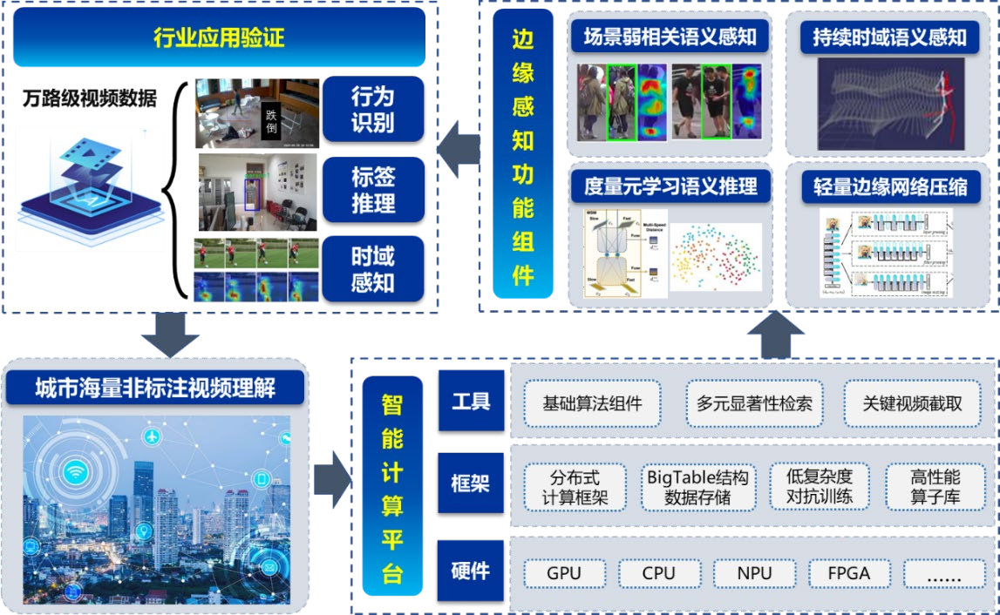

# 面向城市海量非标注视频理解的智能计算验证平台

## 平台介绍

实现城市万路级监控非标注数据网络下的自动化和智能化，是保障社会公共安全和交通管理提供高效可靠的技术手段。本项目基于弱监督、元学习相关的前沿理论研究，结合边缘计算、结构化存储框架，实现更加智能高效的城市海量非标注视频理解。如下图面向城市海量非标注视频理解的智能计算验证平台所示，本项目基于智能的分布式多源异构计算平台，构建分布式计算、结构化存储、低复杂度对抗训练框架，集成场景弱相关语义感知、持续时域语义感知、度量元学习语义推理、轻量化边缘计算网络压缩等功能组件，实现面向万路级城市非标注视频数据的行为识别、标签推理、时域感知等行业应用验证。



在面向城市海量非标注视频理解的智能计算验证平台上，基于完备多样的边缘感知功能组件，实现多模态智能计算技术在精细化城市治理场景下的应用验证。通过场景弱相关的行为识别，能够及时有效地将模型部署在不同场景当中，减少了模型二次调优的需要；通过度量元学习语义标签推理，能够有效提升模型在针对未见的语义类别的判别精度；通过持续性时域感知和结构化语义实践存储，能够在海量数据中快速响应，缓解传输和存储压力，快速响应事件和检索。


项目基于已有的研究基础集成整合的基于弱相关语义特征的元学习度量系统是一款能快速定位行人事件、实时理解语义内容的背景弱相关场景语义感知系统，在少量标注的城市监控场景、海量数据的主动感知等领域具有广泛应用。本系统面向实际场景实现了单样本行为识别任务，对于未见行为语义类别的识别有显著的效果，可以仅通过少量的样本形成类别原型表征，通过度量场景视频特征和原型的特征距离就可以进行未见场景语义类别的识别，显著提升了实际场景中的语义检测能力。

## 数据集

在一般的行为识别任务中，本系统构建了一个包含144个类别，共计156910个样本的数据集用于系统的训练与验证。其中包含了自于“NTU RGB+D 120”数据集的120个类别基础运动数据类别，共计114480个三维骨骼数据。此外，为了增强模型的二维骨骼感知能力，本系统从kinetic数据集抽取了24个代表性行为类别，共计42430个视频样本，并对其提取二维骨骼信息构成数据集内容。

在单样本行为识别任务方面，本系统构建了单样本行为识别数据集，遵循单样本行为识别数据集的规则，训练集由“NTU RGB+D 120”数据集中的100个类别的数据构成，测试集由“NTU RGB+D 120”数据集中的另外20个类别和多摄像头跌倒行为场景视频数据集MCFD构成。在测试集中，本系统将每个类别的样本抽取一个作为参考样本，其他样本作为测试样本。

在无监督行为语义时间定位任务中，本系统从ActivityNet 1.3数据集中随机选择176个样本作为测试集。


## 环境准备

System：Linux Ubuntu20.04

CUDA Version: 11.4

GPU: NVIDIA 3090

Pytorch-gpu: 1.12.1


Python环境可从[requirements.txt](https://github.com/ZJUT-ERCISS/Meta-learning_Metric_System/blob/main/requirements.txt) 或者 [environments.yaml](https://github.com/ZJUT-ERCISS/Meta-learning_Metric_System/blob/main/environment.yaml)中获取. 


可在[此处](https://zjuteducn-my.sharepoint.com/:f:/g/personal/211122120051_zjut_edu_cn/EkTP-ovknK1No901VBEDGPYBJ_4qR9va-gEPhKomH7ydRw?e=aR2G2a)下载相关的checkpoint(.ckpt), pickle(.pkl), list(.list)文件.

## 训练

运行以下命令可进行用于一般行为识别任务的模型的训练：
```
python ./train_model.py
```

## 测试

运行以下命令可以测试模型的一般行为识别性能：
```
python test.py
```
运行以下命令可测试模型在单样本行为识别任务中的度量性能：
```
python metric_eval.py
```


## 推理

首先，需要创建一个包含视频文件路径和类别标签的.list文件作为推理脚本的输入，示例如下:
```
video/example1.mp4 42
video/example2.mp4 42
...
```

之后，可以使用如下命令实现视频的推理：

```
python ./engine/infer_action.py
```


